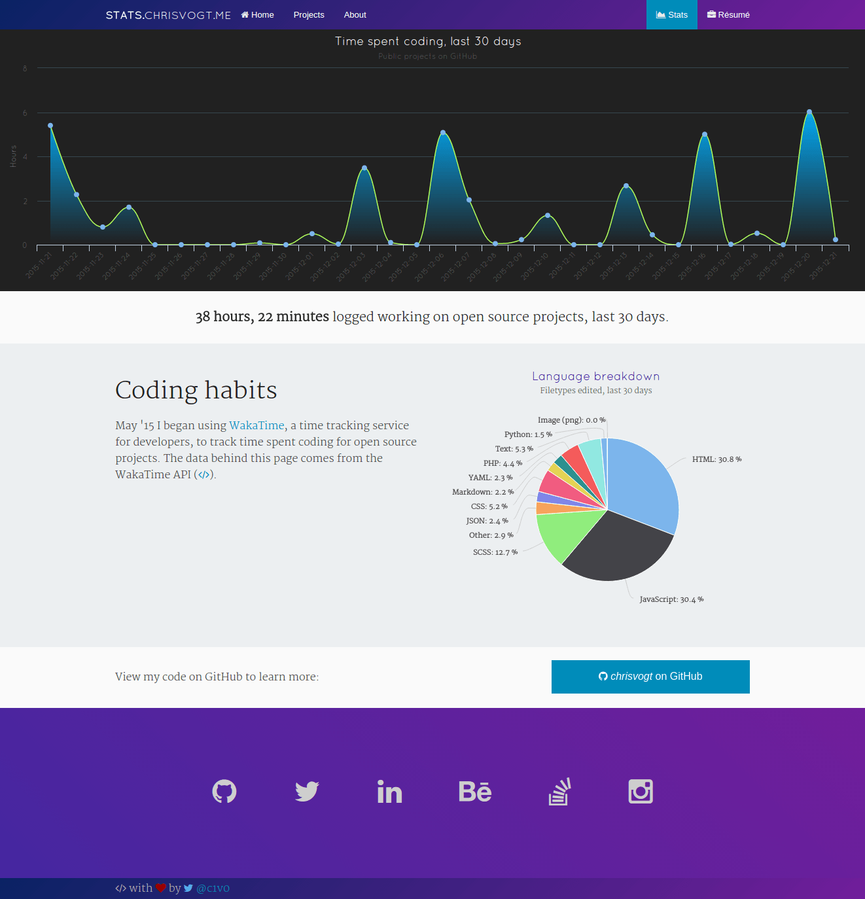

# stats.chrisvogt.me

Personal coding habits report built using CakePHP and data from the [WakaTime](https://wakatime.com) API.

View it live at [stats.chrisvogt.me](https://stats.chrisvogt.me).

### How to use

**1.** Clone the repository.

    git clone https://github.com/chrisvogt/stats

**2.** Install node, Bower, and Composer dependencies.

    npm install && bower install && composer install

**3.** Configure the `.env` file.

    Give `DEBUG` a value greater than 0.

**4.** Use grunt to preview or build.

    grunt  # 'watches' for changes to the scss/js

    grunt publish  # runs golive tasks - minify, concat, etc.

**5.** Serve the webroot directory using the built-in PHP web server

    php -t webroot -S localhost:9000

### Screenshot

### License

[MIT](LICENSE) © [Chris Vogt](https://www.chrisvogt.me).

### Built with

    
    
    
    
    
    

