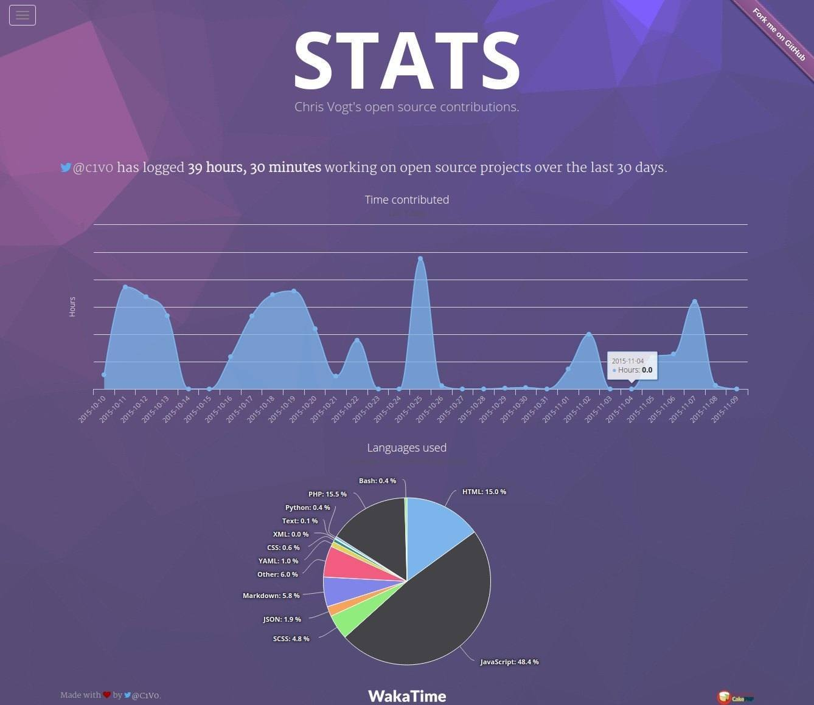

# stats.chrisvogt.me

A dashboard page that reports my public coding habits over the last _n_ days using data from WakaTime, a time tracking service for developers that tracks time spent editing files.

View it live @ [stats.chrisvogt.me](http://stats.chrisvogt.me).

### How to use

**1.** Clone the repository.

    git clone https://github.com/chrisvogt/stats

**2.** Install node dependencies.

    npm install

**3.** Use grunt to preview or build.

    grunt  # 'watches' for changes to the scss/js

    grunt publish  # runs golive tasks - minify, concat, etc.

### Screenshot

### License

[The MIT License](LICENSE).

Copyright (c) 2015 CJ Vogt http://www.chrisvogt.me

Permission is hereby granted, free of charge, to any person obtaining a copy
of this software and associated documentation files (the "Software"), to deal
in the Software without restriction, including without limitation the rights
to use, copy, modify, merge, publish, distribute, sublicense, and/or sell
copies of the Software, and to permit persons to whom the Software is
furnished to do so, subject to the following conditions:

### Built with

    
    
    
    
    
    

